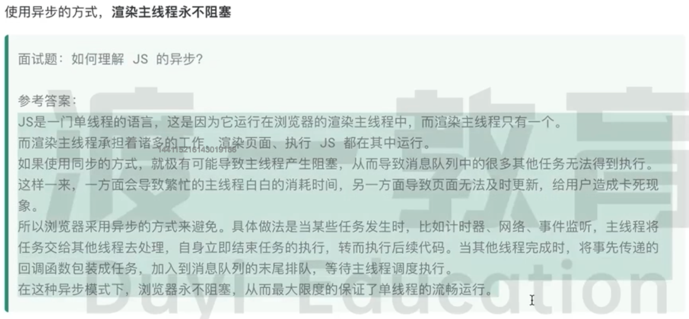
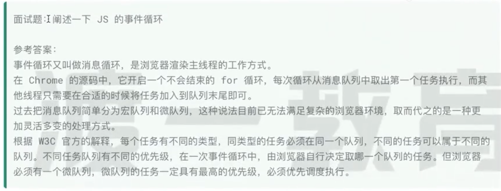
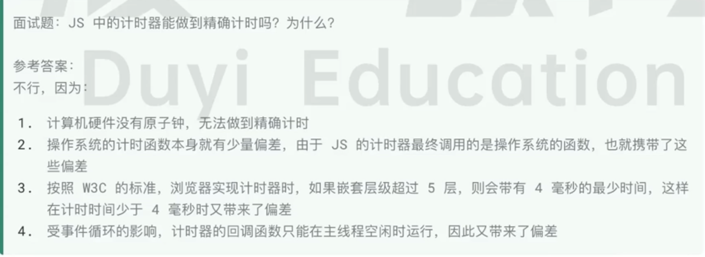
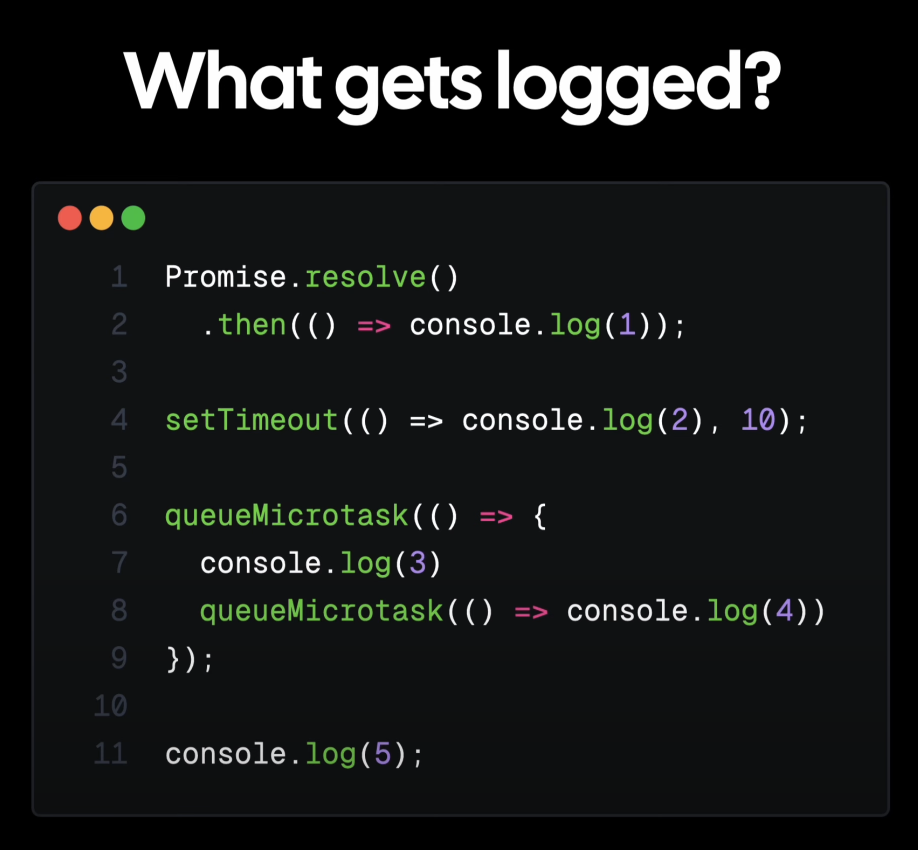

# Eventloop

[eventloop question 1](./questions/eventloop1.js)
[eventloop question 2](./questions/eventloop2.js)

```md
JavaScript 的事件循环是基于事件循环和队列的概念，主要负责执行代码、收集和处理事件以及执行队列中的任务。事件循环的执行顺序大致如下：

1. 执行同步代码：首先，事件循环会执行当前执行栈中的所有同步代码。

2. 执行微任务队列：同步代码执行完毕后，事件循环会检查微任务队列。如果队列中有任务（如 Promise 的 then、catch、finally 回调），则会依次执行这些微任务。微任务队列中的任务会在当前宏任务（即当前执行栈）完成后立即执行。

3. 执行宏任务队列：微任务队列为空后，事件循环会移动到宏任务队列。宏任务包括 setTimeout、setInterval、setImmediate（Node.js）、I/O 操作等。事件循环会取出宏任务队列中的第一个任务执行。每执行完一个宏任务，就会重新检查微任务队列，如果有新的微任务，就会先执行这些微任务。

4. 重复以上步骤：一旦宏任务和微任务队列都为空，事件循环会等待新的任务到来。当新的宏任务被添加到队列中，事件循环会再次启动，重复上述步骤。
```







### Promise 执行顺序

```javascript
new Promise((resolve, reject) => {
    console.log(1);
    resolve(2);
}).then((data) => {console.log(data);});

console.log(3);
```

当这段代码执行时，其运行顺序如下：

创建 Promise 对象： new Promise((resolve, reject) => {...}) 创建一个新的 Promise 对象。这时，传入的执行器函数 (resolve, reject) => {...} 会立即执行。

执行器函数执行： 执行器函数开始执行，打印出 1。

调用 resolve 函数： 在执行器函数内部，调用 resolve(2)。这将会把 Promise 的状态从 "pending"（待定）变为 "fulfilled"（已完成），并且设置 Promise 的结果值为 2。

执行同步代码： 执行器函数执行完毕后，继续执行同步代码，打印出 3。

处理 Promise 的解决状态： 事件循环继续运行，并检查微任务队列。因为 Promise 已经解决了，所以 .then((data) => {console.log(data);}) 中的回调函数会被放入微任务队列。

执行 .then() 中的回调函数： 一旦当前的执行栈为空（即所有同步代码执行完毕），事件循环会从微任务队列中取出 .then() 的回调函数并执行它。这时，会打印出 Promise 的结果值 2。

因此，这段代码的输出顺序将是：

```
1
3
2
```

首先打印 1（Promise 执行器内的同步代码），然后打印 3（Promise 外的同步代码），最后打印 2（Promise 解决后的异步回调）。



answer: 
51342

<a href="https://www.youtube.com/watch?v=eiC58R16hb8" >video answer</a>

### 宏队列Macrotask和微队列Microtask的对象
在 JavaScript 中，任务被加入宏任务队列（Macro Task Queue）和微任务队列（Micro Task Queue）的规则如下：

#### 宏任务队列（Macro Task Queue）:
- 宏任务通常由一些浏览器或环境提供的 API 创建，如：
  - `setTimeout`
  - `setInterval`
  - `setImmediate`（只在 Node.js 中可用）
  - I/O 操作（如文件读写，网络请求等）
  - UI 渲染事件
  - `requestAnimationFrame`（浏览器特有）

当这些操作被调用时，它们的回调函数会被加入到宏任务队列。但不是立即执行，它们的执行会在当前执行栈为空，且当前宏任务完成后的下一个事件循环迭代中执行。

#### 微任务队列（Micro Task Queue）:
- 微任务由以下操作创建：
  - `Promise` 的 `then`、`catch` 和 `finally` 方法
  - `async` 函数的暂停点（await 之后的东西）
  - `MutationObserver` 的回调
  - `queueMicrotask` 方法（直接把queueMicrotask里的参数函数加入到Microtask queue）

微任务队列的执行时机要早于宏任务。在每个宏任务执行完毕后，如果微任务队列不为空，JavaScript 运行时会立即执行微任务队列中的所有任务，直到队列清空。只有在微任务队列清空之后，才会执行下一个宏任务。

**同步任务优先，微队列其次，宏队列最后**

#### 执行顺序:
1. 执行全局脚本代码，这是第一个宏任务。
2. 执行任何由全局脚本代码产生的微任务。
3. 取出一个宏任务执行。
4. 执行任何由宏任务产生的微任务。
5. 重复步骤 3 和步骤 4。

在整个过程中，微任务队列总是优先于宏任务队列被清空，这意味着微任务（如 Promise 回调）的执行时机会早于宏任务（如 setTimeout 回调）。这是为了确保较小的异步操作（如 Promise 解决）能够在较大的异步操作（如 I/O 事件）之前尽快完成，这样可以更快地处理高优先级的任务。


=======================================================

(resolve, reject) => {} 本身就是一个回调函数。在创建一个新的 Promise 对象时，你需要提供一个函数作为参数，这个函数叫做 "执行器"（executor）。这个执行器函数接收两个参数：resolve 和 reject，它们都是函数。

+ resolve 函数用于在异步操作成功时解决（fulfill）Promise。
+ reject 函数用于在异步操作失败时拒绝（reject）Promise。

这个执行器函数 (resolve, reject) => {} 就是一个回调函数，它定义了异步操作成功或失败时如何处理 Promise 的状态。在 Promise 内部，当你## 调用 resolve() 函数时，Promise 的状态会变为 "fulfilled"，并且任何绑定到这个 Promise 的 .then() 方法中的成功回调函数都会被调用。类似地，当你调用 reject() 函数时，Promise 的状态会变为 "rejected"，并且任何绑定到这个 Promise 的 .catch() 方法中的失败回调函数都会被调用。