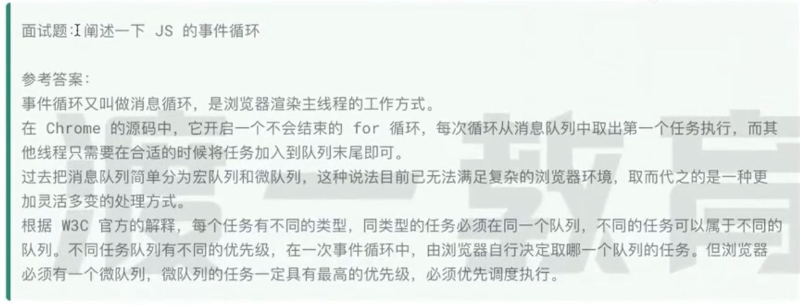
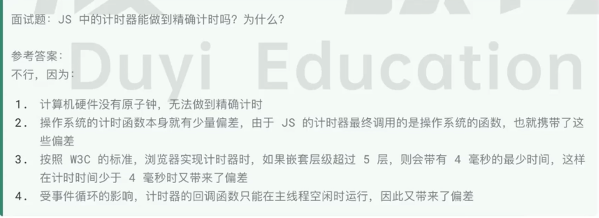

# A Practice of Promise in JavaScript

[中文版 Chinese Version](./README_ZH.md)

[Implemented code](./PromiseHandWrite.js)

### Event Loop and Asynchronous






# Handwritten Promise

## Implemented Code
```javascript
class MyPromise {
    static Pending = 'pending';
    static FulFilled = 'fulfilled';
    static Rejected = 'rejected';

    constructor(executor) {
        this.status = MyPromise.Pending; // Initial status is pending
        this.value = null; // Used to store the value passed by resolve or reject
        this.callbacks = []; // Used to store the callbacks registered by the then method

        try {
            executor(this.resolve, this.reject); // Execute executor, and pass in resolve and reject methods
        } catch (err) {
            this.reject(err); // If executor execution error, directly reject
        }
    }

    // Private method, used to change the status and execute the corresponding callback
    #changeStatus = (status, value) => {
        setTimeout(() => { // Use setTimeout to ensure asynchronous execution
            if (this.status === MyPromise.Pending) { // The status can only change from pending
                this.status = status; // Change status
                this.value = value; // Save value
                this.callbacks.forEach((callback) => { // Execute all callbacks
                    if (status === MyPromise.FulFilled) {
                        callback.onFulFilled(this.value);
                    } else if (status === MyPromise.Rejected) {
                        callback.onRejected(this.value);
                    }
                });
            }
        }, 0);
    };

    // resolve method
    resolve = (data) => {
        this.#changeStatus(MyPromise.FulFilled, data);
    };

    // reject method
    reject = (data) => {
        this.#changeStatus(MyPromise.Rejected, data);
    };

    // then method
    then = (onFulFilled, onRejected) => {
        return new MyPromise((resolve, reject) => {
            // In order to chain calls, you need to ensure that onFulFilled and onRejected always return a value
            onFulFilled = typeof onFulFilled === 'function' ? onFulFilled : (value) => { return value; };
            onRejected = typeof onRejected === 'function' ? onRejected : (err) => { throw new Error(err); };

            // Function for handling callbacks
            const handleCallback = (callback, value) => {
                setTimeout(() => {
                    try {
                        const result = callback(value); // Execute callback
                        if (result instanceof MyPromise) { // If the callback returns a MyPromise instance, wait for it to resolve
                            result.then(resolve, reject);
                        } else {
                            resolve(result); // Otherwise, directly resolve the result
                        }
                    } catch (err) {
                        reject(err); // If the callback execution error, directly reject
                    }
                }, 0);
            };

            // Perform the corresponding operation according to the current status
            if (this.status === MyPromise.Pending) {
                this.callbacks.push({
                    onFulFilled: value => handleCallback(onFulFilled, value),
                    onRejected: err => handleCallback(onRejected, err)
                });
            } else if (this.status === MyPromise.FulFilled) {
                handleCallback(onFulFilled, this.value);
            } else if (this.status === MyPromise.Rejected) {
                handleCallback(onRejected, this.value);
            }
        });
    };

    // catch method
    catch(onRejected) {
        return this.then(null, onRejected); // Call the then method to handle the rejected situation, must add return, if not added, this catch function will return undefined, not the result of then(null,onRejected).
    }

    // finally method (unfinished)
    // finally = (onFinally) => {
    //     return this.then(
    //         (value) => {
    //             onFinally();
    //             return value; // Ensure that you can continue to chain calls after finally
    //         },
    //         (reason) => {
    //             onFinally();
    //             throw reason; // Ensure that errors can continue to be passed
    //         }
    //     );
    // };
}

// Test case
const MyInstance = new MyPromise((resolve, reject) => {
    setTimeout(() => {
        resolve('this

 is

 a test for MyPromise.'); // Asynchronously resolve
    }, 1000);
});

MyInstance.then((value) => {
    console.log(`First then: ${value}`);
    return new MyPromise((resolve, reject) => {
        setTimeout(() => {
            resolve("Second value"); // Return a new MyPromise instance
        }, 1000);
    });
})
.then((value) => {
    console.log(`Second then: ${value}`);
    return "Third value"; // Return a normal value
})
.then((value) => {
    console.log(`Third then: ${value}`);
    throw new Error("An error occurred"); // Throw an error
})
.catch((error) => {
    console.error(`Catch: ${error.message}`);
    return new MyPromise((resolve, reject) => {
        setTimeout(() => {
            resolve("Recovered value"); // Return a new MyPromise instance after error handling
        }, 1000);
    });
})
.then((value) => {
    console.log(`Fourth then: ${value}`); // Handle the final result
});

```

## The order of chain calls when generating instances:

### The then is triggered only when the previous Promise is resolved (resolve or reject)
***When the callback function in the first then is added to the microtask queue, it will wait for the MyInstance Promise to be resolved before executing. During the execution of this callback function, if it returns a new Promise (as in your example, a new MyPromise instance is returned), then the callback function in the second then will wait for this new Promise to be resolved before being added to the microtask queue.***

=====================================================

**When executing then, assuming asynchronous, the previous Promise has not yet resolved or rejected, the status is still Pending, at this time, first add the onFulFilled and onRejected functions to the callbacks queue**
```js
if (this.status === MyPromise.Pending) {
    this.callbacks.push({
        onFulFilled: value => handleCallback(onFulFilled, value),
        onRejected: err => handleCallback(onRejected, err)
    });
}
```
===>
**After the previous Promise completes the asynchronous operation, the status changes to FulFilled or Rejected, and resolve or reject is also executed**
```js
resolve = (data) => {
    this.#changeStatus(MyPromise.FulFilled, data);
};
```
===>

**resolve and reject will call the #changeStatus method, and the setTimeout in the changeStatus method will execute the steps inside asynchronously**
```js
#changeStatus = (status, value) => {
    setTimeout(() => { // Use setTimeout to ensure asynchronous execution
        if (this.status === MyPromise.Pending) { // The status can only change from pending
            this.status = status; // Change status
            this.value = value; // Save value
            this.callbacks.forEach((callback) => { // Execute all callbacks
                if (status === MyPromise.FulFilled) {
                    callback.onFulFilled(this.value); // If it is resolve, execute this, turn to value => handleCallback(onFulFilled, value)
                } else if (status === MyPromise.Rejected) {
                    callback.onRejected(this.value); // If it is reject, execute this, turn to err => handleCallback(onRejected, err)
                }
            });
        }
    }, 0);
};
```

===>
**Because it was added to the callbacks queue before**
```js
{
    onFulFilled: value => handleCallback(onFulFilled, value),
    onRejected: err => handleCallback(onRejected, err)
}
```

**So what is executed at this time is**

```js
value => handleCallback(onFulFilled, value)
err => handleCallback(onRejected, err)
```

**At this time, return to the handleCallback method, execute resolve or reject asynchronously, if the callback representing onFulFilled or onRejected returns a Promise instance, wait for this instance to resolve or reject.**

Here's the English version of the excerpt from your README.md:

```markdown
```js
value => handleCallback(onFulfilled, value)
err => handleCallback(onRejected, err)
```

**At this point, we return to the handleCallback method, execute resolve or reject asynchronously. If the callback representing onFulfilled or onRejected returns a Promise instance, we wait for this instance to resolve or reject.**

```js
const handleCallback = (callback, value) => {
    setTimeout(() => {
        try {
            const result = callback(value); // Execute callback
            if (result instanceof MyPromise) { // If callback returns a MyPromise instance, wait for it to resolve
                result.then(resolve, reject);
            } else {
                resolve(result); // Otherwise, directly resolve the result
            }
        } catch (err) {
            reject(err); // If an error occurs during callback execution, directly reject
        }
    }, 0);
};
```

### Simple Summary:

1. Calling the then method: When .then() is called, it checks the status of the Promise. If the status is Pending, it adds the callback functions (onFulfilled and onRejected) to the callback queue to wait for execution.

2. Promise resolution: When the Promise's asynchronous operation is completed, it calls the resolve or reject method to change the Promise's status (Fulfilled or Rejected) and set the result value.

3. Callback execution: After changing the status, it asynchronously executes the callback functions in the callback queue. This is implemented through setTimeout to ensure that they run after the current execution stack is completed.

4. Chaining: If the callback function in .then() returns a new Promise (result), the callback in the next .then() will wait for this new Promise to resolve before it executes. If the callback returns a non-Promise value, or does not return a value, it directly passes this value as the input to the next .then().

5. Error handling: If an error occurs during callback execution, or if the callback function returns a Promise in the Rejected state, it jumps to the nearest .catch() or .then() with an onRejected callback in the chain to handle the error.


## What exactly does then return?

The .then() method returns a new Promise object. The resolution status (fulfilled or rejected) and value of this new Promise object depend on the execution result of the callback function passed into the .then() method.

```js
// then method
then = (onFulfilled, onRejected) => {
    return new MyPromise((resolve, reject) => { // <== Returns this new Promise object, the status of the new Promise depends on the execution result of the callback function (onFulfilled or onRejected)
    // ...other code
```

#### 1. The callback function returns a value

If the callback function returns a value (not a Promise), then the new Promise object will be resolved (fulfilled) and carry that return value.

```javascript
let promise = new Promise((resolve, reject) => {
    resolve(10);
});

promise
    .then((result) => {
        console.log(result); // Output: 10
        return result * 2;   // Return a value
    })
    .then((result) => {
        console.log(result); // Output: 20
    });
```
In this example, the first .then() returns a value of 20, so the result received by the second .then() is 20.

#### 2. The callback function throws an error

If the callback function throws an error, then the new Promise object will be rejected and carry that error as the reason.

```js
let promise = new Promise((resolve, reject) => {
    resolve(10);
});

promise
    .then((result) => {
        throw new Error('Something went wrong'); // Throw an error
    })
    .catch((error) => {
        console.error(error.message); // Output: "Something went wrong"
    });
```
In this example, the first .then() throws an error, so the following .catch() catches this error.

#### 3. The callback function returns another Promise object

If the callback function returns another Promise object, then the new Promise object will "follow" this returned Promise. That is, the status and value of the new Promise will be the same as the returned Promise.

```js
let promise = new Promise((resolve, reject) => {
    resolve(10);
});

promise
    .then((result) => {
        return new Promise((resolve, reject) => {
            setTimeout(() => {
                resolve(result * 2); // Return a Promise
            }, 1000);
        });
    })
    .then((result) => {
        console.log(result); // Output: 20 (after 1 second)
    });
```
In this example, the first .then() returns a new Promise object. This new Promise is resolved after 1 second, and its value is 20. Therefore, the result in the second .then() is 20, and its execution starts after the previous Promise is resolved.